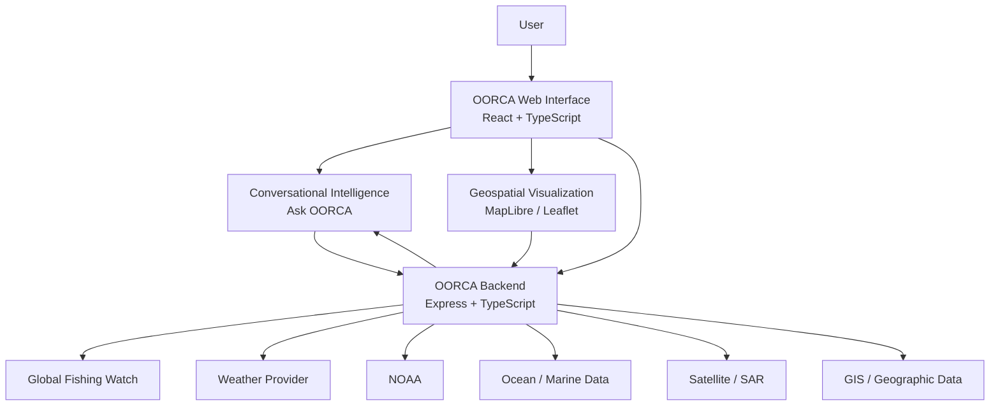

# OORCA

### Marine Intelligence for a Changing Ocean

OORCA is a marine intelligence platform that brings together **satellite
observations, fishing activity, weather, ocean conditions, geospatial
data, and conversational AI** in one place.

Instead of forcing users to search through different datasets, OORCA
turns marine data into something easier to understand:

**Observe → Detect → Correlate → Reason → Explain**

------------------------------------------------------------------------

```{=html}
<p align="center">
```
``{=html}
```{=html}
</p>
```
```{=html}
<p align="center">
```
`<strong>`{=html}Understand the ocean. Connect the data. Make better
decisions.`</strong>`{=html}
```{=html}
</p>
```
```{=html}
<p align="center">
```
`<a href="#what-is-oorca">`{=html}What is OORCA?`</a>`{=html} ·
`<a href="#features">`{=html}Features`</a>`{=html} ·
`<a href="#how-it-works">`{=html}How it works`</a>`{=html} ·
`<a href="#getting-started">`{=html}Getting started`</a>`{=html}
```{=html}
</p>
```

------------------------------------------------------------------------

## What is OORCA?

Marine information is spread across many different systems.

Satellite imagery tells us what is happening on the surface.

Weather services tell us about atmospheric conditions.

Oceanographic data tells us about the sea.

Fishing datasets show human activity.

GIS layers tell us about boundaries, protected areas, and other
geographic constraints.

OORCA brings these pieces together and adds a conversational reasoning
layer on top.

A user can ask:

> **"Is it safe to go fishing tomorrow?"**

or:

> **"Where is fishing activity highest?"**

or:

> **"Why was this marine region flagged?"**

OORCA can combine the relevant information and present the result
through maps, indicators, evidence, and a natural-language explanation.

------------------------------------------------------------------------

## Built for Marine Intelligence

OORCA is being developed around **Smart India Hackathon Problem
Statement 26176**:

> **ORCA --- Marine EcOsystem Reasoning with Collaborative Agents**

The platform focuses on the core challenge described by the problem
statement:

-   Understanding natural-language marine queries
-   Discovering relevant datasets
-   Combining heterogeneous marine information
-   Performing spatial and temporal reasoning
-   Providing explainable recommendations
-   Supporting fishermen and marine operators
-   Visualizing information through maps and dashboards
-   Providing marine safety and environmental context

OORCA also retains its earlier **marine incident investigation**
capabilities as a separate workflow.

------------------------------------------------------------------------

# The OORCA Idea

``` text
                   USER QUESTION
                         │
                         ▼
                ┌─────────────────┐
                │  OORCA AI LAYER │
                └────────┬────────┘
                         │
              Understand user intent
                         │
          ┌──────────────┼──────────────┐
          ▼              ▼              ▼
       WEATHER          GFW          SATELLITE
          │              │              │
          ▼              ▼              ▼
       OCEAN DATA      FISHING       ANOMALIES
          │              │              │
          └──────────────┼──────────────┘
                         ▼
                CONTEXTUAL REASONING
                         │
                         ▼
              MAP + EVIDENCE + ANSWER
```

The important part is not a single dataset.

It is the **correlation between datasets**.

------------------------------------------------------------------------

# Features

## 1. Marine Intelligence

The `/intelligence` workspace is the conversational entry point to
OORCA.

It combines:

-   Natural-language interaction
-   Marine conditions
-   Environmental observations
-   Fishing information
-   Geospatial context
-   Safety information
-   Evidence and reasoning
-   Interactive marine maps

### Example questions

``` text
Where is the nearest Potential Fishing Zone?

Is it safe to venture into the sea tomorrow?

What are the sea conditions near my location?

Are there any weather risks?

Where is fishing activity highest?

Why was this area flagged?

Which areas should be avoided?
```

------------------------------------------------------------------------

## 2. Fishery & Climate Intelligence

The `/simulation` workspace is being evolved into a broader **Fishery &
Climate Intelligence** view.

Instead of focusing on a single marine event, the page brings together:

-   Fishing activity
-   Fishing effort
-   Weather
-   Wind
-   Marine conditions
-   Environmental indicators
-   Marine anomalies
-   Geospatial context

The map acts as the main workspace.

> **One map. Multiple sources. One explanation.**

### Screenshot

Add the latest UI screenshot here:

``` text
docs/screenshots/fishery-climate.png
```


------------------------------------------------------------------------

## 3. Marine Anomaly Detection

OORCA can use satellite/SAR analysis to identify unusual surface
observations.

The current ML capability was developed around oil-slick/leak detection.
In the broader Marine Intelligence workflow, the result can be treated
as a **SAR anomaly candidate** and then examined alongside other
information.

The important idea is:

``` text
SAR observation
      +
Weather
      +
Fishing activity
      +
Ocean conditions
      +
Geospatial context
      ↓
OORCA reasoning
```

This prevents a single observation from being treated as the complete
answer.

### Screenshot

``` text
docs/screenshots/anomaly-detection.png
```


------------------------------------------------------------------------

## 4. Global Fishing Watch Integration

OORCA includes backend integration for fishing and vessel intelligence.

Current API routes include:

``` text
GET /api/environment/fishing-effort
GET /api/environment/vessels
GET /api/environment/vessels/identity
POST /api/environment/vessels/risk-assessment
```

Fishing information can be used to understand:

-   Fishing activity
-   Fishing effort
-   Activity hotspots
-   Vessel presence
-   Spatial relationships between fishing and environmental conditions

Where an external dataset is unavailable, the interface should clearly
identify modelled/demo information rather than presenting it as live
data.

------------------------------------------------------------------------

## 5. Weather Intelligence

OORCA provides a normalized weather endpoint:

``` text
GET /api/environment/weather
```

Weather information can contribute:

-   Temperature
-   Wind
-   Precipitation
-   Pressure
-   Visibility
-   Forecast information
-   Weather risk

Weather becomes more useful when combined with other marine information.

For example:

``` text
High fishing activity
        +
Strong winds
        +
Poor visibility
        ↓
Higher operational risk
```

------------------------------------------------------------------------

## 6. Ocean & Environmental Data

OORCA includes services for oceanographic and environmental information.

Depending on the configured data providers, the system can work with
information such as:

-   Sea surface temperature
-   Chlorophyll
-   Ocean currents
-   Wave conditions
-   Tidal information
-   Visibility
-   Environmental indicators

The application distinguishes between:

  Status          Meaning
  --------------- -----------------------------------
  `LIVE`          Current external feed
  `OBSERVED`      Observation
  `FORECAST`      Forecast/model output
  `MODELLED`      Generated by a model
  `ESTIMATED`     Estimated value
  `DEMO`          Demonstration data
  `UNAVAILABLE`   Data source currently unavailable

This distinction is important because **modelled data is not the same as
observed data**.

------------------------------------------------------------------------

# OORCA Reasoning

One of the main ideas behind OORCA is that retrieving data is not
enough.

The system should explain **why** a recommendation was produced.

For example:

``` text
WHY WAS THIS AREA FLAGGED?

✓ Satellite observation
✓ Fishing activity
✓ Weather conditions
✓ Ocean conditions
✓ Geographic context

OORCA assessment:

The observed marine anomaly overlaps an area
with elevated fishing activity.

Weather conditions are currently moderate.

No available geographic restriction was detected.

Assessment:
Requires further investigation.
```

The exact explanation depends on the data available for the selected
location.

------------------------------------------------------------------------

# Conversational AI

OORCA includes an `Ask OORCA` interface.

The conversational layer is designed to turn a natural-language question
into a marine information workflow.

``` text
User
 │
 ▼
Intent
 │
 ▼
Required data
 │
 ├── Weather
 ├── Fishing
 ├── Ocean
 ├── Satellite
 └── GIS
 │
 ▼
Reasoning
 │
 ▼
Evidence
 │
 ▼
Answer
```

This is the foundation for the collaborative-agent architecture
described in SIH PS-26176.

------------------------------------------------------------------------

# Interactive Maps

Maps are a central part of the OORCA experience.

Depending on the active workspace, the map can display:

-   Marine anomalies
-   Fishing activity
-   Vessel activity
-   Weather context
-   Marine conditions
-   Environmental indicators
-   Protected areas
-   Restricted zones
-   Investigation layers

### Screenshot

``` text
docs/screenshots/marine-map.png
```


------------------------------------------------------------------------

# Marine Safety & Risk

OORCA can surface marine hazards and operational risks.

Examples include:

-   High winds
-   High waves
-   Lightning
-   Cyclones
-   Heavy rain
-   Navigation risk
-   Restricted waters
-   Protected areas
-   Environmental risk

The goal is not simply to display an alert.

The goal is to provide the surrounding context.

``` text
HAZARD
  ↓
LOCATION
  ↓
TIME
  ↓
MARINE CONDITIONS
  ↓
USER CONTEXT
  ↓
EXPLAINED RISK
```

------------------------------------------------------------------------

# Geospatial Reasoning

Marine decisions depend heavily on location.

OORCA can combine geographic information with marine observations to
identify relationships such as:

``` text
Fishing activity
       │
       ├──── Marine Protected Area
       │
       ├──── Restricted waters
       │
       ├──── Weather hazard
       │
       └──── Environmental anomaly
```

This allows the platform to move from:

> "There is an alert."

to:

> "This alert matters because it affects this particular area and
> activity."

------------------------------------------------------------------------

# Two OORCA Workflows

OORCA currently contains two closely related operational workflows.

## Marine Intelligence --- PS 26176

``` text
Ask OORCA
    ↓
Marine Data
    ↓
Correlation
    ↓
Reasoning
    ↓
Recommendation
```

Designed for:

-   Fishermen
-   Researchers
-   Maritime operators
-   Coastal authorities
-   Environmental users
-   Disaster-management stakeholders

## Incident Investigation

The original OORCA investigation workflow remains available for marine
incident analysis.

It includes capabilities such as:

-   Satellite/SAR analysis
-   Drift modelling
-   Historical AIS correlation
-   Vessel investigation
-   Environmental impact analysis

These capabilities are kept separate so that the Marine Intelligence
experience remains simple.

------------------------------------------------------------------------

# System Architecture



------------------------------------------------------------------------

# Technology Stack

### Frontend

-   React
-   TypeScript
-   Vite
-   Tailwind CSS
-   React Router
-   Lucide React
-   MapLibre GL
-   Leaflet
-   Motion

### Backend

-   Node.js
-   Express
-   TypeScript
-   TSX
-   REST APIs

### Intelligence

-   Gemini API / conversational intelligence
-   Existing OORCA analysis services
-   SAR/EO model integration
-   Geospatial reasoning

### Data

-   Global Fishing Watch
-   Weather services
-   NOAA
-   Oceanographic data services
-   Satellite Earth Observation
-   GIS datasets

------------------------------------------------------------------------

# Project Structure

``` text
OORCA/
│
├── backend/
│   ├── api/
│   │   ├── alerts.routes.ts
│   │   ├── environment.routes.ts
│   │   ├── intelligence.routes.ts
│   │   └── simulation.routes.ts
│   │
│   ├── controllers/
│   ├── providers/
│   │   ├── gfw.provider.ts
│   │   ├── weather.provider.ts
│   │   ├── ocean.provider.ts
│   │   ├── geographic.provider.ts
│   │   └── noaaAlerts.provider.ts
│   │
│   ├── services/
│   ├── models/
│   ├── types/
│   └── utils/
│
├── src/
│   ├── components/
│   │   ├── intelligence/
│   │   ├── simulation/
│   │   ├── alerts/
│   │   ├── layout/
│   │   └── brand/
│   │
│   ├── pages/
│   │   ├── IntelligencePage.tsx
│   │   ├── SimulationPage.tsx
│   │   └── AlertCenterPage.tsx
│   │
│   ├── services/
│   ├── data/
│   ├── types/
│   └── utils/
│
├── public/
│   └── assets/
│
├── server.ts
├── package.json
├── vite.config.ts
└── .env.example
```

------------------------------------------------------------------------

# Main Routes

  Route             Purpose
  ----------------- ------------------------------------------------
  `/`               OORCA landing page
  `/intelligence`   Marine Intelligence & conversational workspace
  `/simulation`     Fishery & Climate / marine analysis workspace
  `/alerts`         Marine alerts and incident workflow

------------------------------------------------------------------------

# API Routes

### Intelligence

``` text
POST /api/intelligence/query
GET  /api/intelligence/conditions
```

### Environment

``` text
GET  /api/environment
GET  /api/environment/weather
GET  /api/environment/vessels
GET  /api/environment/vessels/identity
POST /api/environment/vessels/risk-assessment
GET  /api/environment/fishing-effort
```

### Alerts

``` text
GET  /api/alerts/incidents
GET  /api/alerts/incident/:id
POST /api/alerts/scan
GET  /api/alerts/sources
```

### Simulation

``` text
POST /api/simulation/start
GET  /api/simulation
GET  /api/simulation/:id
GET  /api/simulation/:id/timeline
GET  /api/simulation/:id/measurements
```

------------------------------------------------------------------------

# Getting Started

## Requirements

Install:

-   Node.js 18+
-   npm
-   Git

Check your versions:

``` bash
node --version
npm --version
```

------------------------------------------------------------------------

## Installation

Clone the repository:

``` bash
git clone <YOUR_REPOSITORY_URL>
cd OORCA
```

Install dependencies:

``` bash
npm install
```

Create your environment file:

``` bash
cp .env.example .env
```

On Windows PowerShell:

``` powershell
Copy-Item .env.example .env
```

Add your API credentials.

Then start OORCA:

``` bash
npm run dev
```

Open:

``` text
http://localhost:3000
```

------------------------------------------------------------------------

# Environment Variables

OORCA is designed to use external services through environment
variables.

Example:

``` env
PORT=3000

GFW_API_TOKEN=
NOAA_API_KEY=
OCEAN_DATA_API_KEY=
OPENWEATHER_API_KEY=
CARTO_API_KEY=

COPERNICUS_API_KEY=

VITE_AIS_API_KEY=
VITE_MAP_API_KEY=
VITE_SATELLITE_API_KEY=
VITE_WEATHER_API_KEY=
VITE_OCEAN_DATA_API_KEY=
VITE_CARTO_API_KEY=
VITE_GFW_API_TOKEN=
```

For production deployments, keep private credentials on the server side
whenever possible.

**Never commit real API keys to Git.**

------------------------------------------------------------------------

# Data Honesty

OORCA can work with multiple types of information.

We intentionally distinguish them:

``` text
LIVE
OBSERVED
FORECAST
MODELLED
ESTIMATED
DEMO
UNAVAILABLE
```

This matters because a model prediction should never be presented as a
direct observation.

The same principle applies to external API failures.

If a real data provider is unavailable, OORCA should show that state
instead of silently pretending that generated values are live.

------------------------------------------------------------------------

# Demo Flow

For a quick demonstration:

### 01 --- Open OORCA

Start at the landing page.

Show the main concept:

> Marine information → reasoning → decision support

### 02 --- Open Marine Intelligence

Navigate to:

``` text
/intelligence
```

Ask:

> "What are the current marine conditions?"

### 03 --- Explore the Map

Show:

-   Fishing activity
-   Marine conditions
-   Environmental information
-   Geographic context

### 04 --- Select an Area

Show the supporting evidence.

### 05 --- Ask OORCA

Try:

> "Is it safe to venture into the sea tomorrow?"

Then:

> "Why was this area flagged?"

### 06 --- Open Fishery & Climate

Navigate to:

``` text
/simulation
```

Show fishing activity and weather together.

### 07 --- Show Incident Response

Open:

``` text
/alerts
```

This demonstrates the original investigation capabilities of OORCA.

------------------------------------------------------------------------

# Suggested README Screenshots

The best README version should include real screenshots from the current
application.

Place these files under:

``` text
docs/
└── screenshots/
    ├── 01-home.png
    ├── 02-intelligence.png
    ├── 03-fishery-climate.png
    ├── 04-marine-map.png
    ├── 05-anomaly.png
    ├── 06-ask-oorca.png
    ├── 07-marine-safety.png
    ├── 08-incident-response.png
    └── 09-architecture.png
```

Then use:

``` md


```

**Real screenshots are strongly preferred over generic stock images.**

------------------------------------------------------------------------

# Why OORCA?

Most marine datasets are useful individually.

The harder problem is understanding how they relate.

OORCA focuses on that missing layer:

``` text
             DATA
              │
     ┌────────┼────────┐
     ▼        ▼        ▼
 Satellite  Weather  Fishing
     │        │        │
     └────────┼────────┘
              ▼
        OORCA REASONING
              │
       ┌──────┴──────┐
       ▼             ▼
   MAP / DATA     EXPLANATION
       │             │
       └──────┬──────┘
              ▼
       DECISION SUPPORT
```

The goal is not to make users understand every dataset.

The goal is to make the information **useful**.

------------------------------------------------------------------------

# Current Development Focus

The current development priority is a lightweight, reliable
demonstration of the core PS-26176 workflow:

-   Real external data where available
-   Marine maps
-   Fishing activity
-   Weather
-   Environmental context
-   Marine anomaly candidates
-   Conversational interaction
-   Evidence-based reasoning
-   Clear data provenance

Complex features are intentionally kept separate from the main Marine
Intelligence experience.

------------------------------------------------------------------------

# Future Scope

Possible future extensions include:

-   More satellite EO products
-   Automated anomaly discovery
-   More regional Indian languages
-   Advanced multi-agent orchestration
-   Route optimization
-   Improved PFZ estimation
-   More oceanographic datasets
-   Real-time alert streams
-   Historical marine trend analysis
-   More detailed climate indicators
-   On-device or edge intelligence
-   Automated marine reports

------------------------------------------------------------------------

# SIH PS-26176 Alignment

OORCA maps naturally to the core requirements of the problem statement:

  -----------------------------------------------------------------------
  PS-26176 Requirement                OORCA
  ----------------------------------- -----------------------------------
  Natural-language interaction        Ask OORCA

  Contextual conversation             Conversational intelligence

  Marine data integration             Weather, GFW, ocean and satellite
                                      sources

  EO data                             SAR / satellite analysis

  Spatial reasoning                   Interactive geospatial map

  Temporal reasoning                  Forecast and time-aware data

  Explainable recommendations         Evidence + reasoning panel

  Fisher safety                       Marine Safety & Risk

  Geofencing                          Geographic layers

  Fishing intelligence                GFW fishing activity

  Environmental intelligence          Ocean + environmental indicators

  Collaborative intelligence          Modular OORCA services and
                                      reasoning pipeline
  -----------------------------------------------------------------------

------------------------------------------------------------------------

# Project Philosophy

OORCA follows a simple principle:

> **Don't just show the data. Explain what the data means together.**

A weather forecast alone is useful.

A fishing map alone is useful.

A satellite image alone is useful.

But combining them can answer a much more useful question:

> **"What is happening here, and what should I know before making a
> decision?"**

That is the problem OORCA is built to solve.

------------------------------------------------------------------------

# Team

Built for **Smart India Hackathon**.

**Project:** OORCA\
**Focus:** Marine Intelligence & Environmental Decision Support\
**Problem Statement:** SIH 26176\
**Organization:** ISRO / Department of Space

------------------------------------------------------------------------

# License

This project is licensed under the Apache License 2.0.

See `LICENSE` for details.

------------------------------------------------------------------------

```{=html}
<p align="center">
```
`<strong>`{=html}OORCA`</strong>`{=html}`<br>`{=html} Marine
Intelligence for a Changing Ocean
```{=html}
</p>
```
