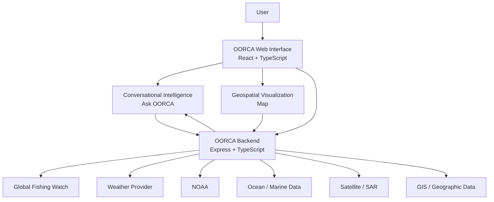

# OORCA

## Marine Intelligence for a Changing Ocean

OORCA is a marine intelligence platform that brings together **satellite observations, fishing activity, weather, ocean conditions, geospatial data, and conversational AI** in one place.

The goal is simple:

> **Observe → Detect → Correlate → Reason → Explain**

---

## What is OORCA?

Marine information is spread across many different systems.

Satellite data shows what is happening on the surface. Weather services describe atmospheric conditions. Oceanographic data describes the sea. Fishing datasets show human activity. GIS layers provide geographic context.

OORCA brings these sources together and turns them into understandable marine intelligence.

Users can ask questions such as:

- Where is fishing activity highest?
- What are the current marine conditions?
- Is it safe to venture into the sea tomorrow?
- Why was this region flagged?
- Which areas should be avoided?
- What environmental changes are occurring?

OORCA combines the relevant information and presents it through **maps, indicators, evidence, alerts, and conversational explanations**.

---

## Built for Marine Intelligence

OORCA is being developed around **Smart India Hackathon Problem Statement 26176**:

**ORCA — Marine EcOsystem Reasoning with Collaborative Agents**

The platform focuses on:

- Natural-language marine queries
- Marine data discovery
- Multiple data-source integration
- Spatial and temporal reasoning
- Explainable recommendations
- Fishing intelligence
- Marine safety
- Environmental intelligence
- Interactive geospatial visualization

OORCA also retains its earlier marine incident-investigation capabilities as a separate workflow.

---

## OORCA at a Glance

```text
                       USER
                        │
                        ▼
               ┌─────────────────┐
               │    ASK OORCA    │
               └────────┬────────┘
                        │
                 Understand intent
                        │
       ┌────────────────┼────────────────┐
       ▼                ▼                ▼
    WEATHER            GFW             SATELLITE
       │                │                │
       ▼                ▼                ▼
   CONDITIONS        FISHING         OBSERVATIONS
       │                │                │
       └────────────────┼────────────────┘
                        ▼
               OORCA REASONING
                        │
                        ▼
             MAP + EVIDENCE + ANSWER
```

---

# Core Features

## 1. Marine Intelligence

The `/intelligence` workspace is the conversational entry point to OORCA.

It combines:

- Natural-language interaction
- Marine conditions
- Environmental observations
- Fishing information
- Geospatial context
- Safety information
- Evidence and reasoning
- Interactive marine maps

### Example questions

> Where is the nearest Potential Fishing Zone?

> Is it safe to venture into the sea tomorrow?

> What are the sea conditions near my fishing location?

> Are there any weather risks?

> Where is fishing activity highest?

> Why was this area flagged?

---

## 2. Fishery & Climate Intelligence

The `/simulation` workspace is being evolved into a **Fishery & Climate Intelligence** view.

It brings together:

- Fishing activity
- Fishing effort
- Weather
- Wind
- Marine conditions
- Environmental indicators
- Marine anomalies
- Geospatial context

The map is the main workspace.

> **One map. Multiple sources. One explanation.**

### Add screenshot

Place your screenshot at:

`docs/screenshots/fishery-climate.png`

Then this section will render:


---

## 3. Marine Anomaly Detection

OORCA can use satellite/SAR analysis to identify unusual surface observations.

The current ML capability was developed around oil-slick/leak detection. In the broader Marine Intelligence workflow, the result can be treated as a **SAR anomaly candidate** and examined alongside other information.

The idea is:

```text
SAR observation
      +
Weather
      +
Fishing activity
      +
Ocean conditions
      +
Geospatial context
      ↓
OORCA reasoning
```

A single observation is therefore not treated as the complete answer.

### Add screenshot

`docs/screenshots/anomaly-detection.png`


---

## 4. Global Fishing Watch

OORCA includes backend integration for fishing intelligence.

Fishing information can be used to understand:

- Fishing activity
- Fishing effort
- Activity hotspots
- Vessel presence
- Relationships between fishing and environmental conditions

The main endpoint currently used by the application is:

```text
GET /api/environment/fishing-effort
```

Other vessel-related endpoints include:

```text
GET /api/environment/vessels
GET /api/environment/vessels/identity
POST /api/environment/vessels/risk-assessment
```

OORCA should clearly distinguish real external information from modelled or demonstration data.

---

## 5. Weather Intelligence

OORCA provides weather information through its backend.

Main endpoint:

```text
GET /api/environment/weather
```

Depending on the configured provider, this can include:

- Temperature
- Wind speed
- Wind direction
- Precipitation
- Pressure
- Visibility
- Forecast information
- Weather alerts

Weather becomes more useful when correlated with other marine information.

```text
High fishing activity
        +
Strong winds
        +
Poor visibility
        ↓
Higher operational risk
```

---

## 6. Ocean & Environmental Intelligence

OORCA can work with environmental and oceanographic information such as:

- Sea surface temperature
- Chlorophyll
- Ocean currents
- Wave conditions
- Tide
- Visibility
- Environmental indicators

Only values actually available from configured data sources should be displayed.

---

# OORCA Reasoning

Retrieving data is not enough.

OORCA is designed to explain **why** a recommendation or observation matters.

Example:

```text
WHY WAS THIS AREA FLAGGED?

✓ Satellite observation
✓ Fishing activity
✓ Weather conditions
✓ Ocean conditions
✓ Geographic context

ASSESSMENT

The observed marine anomaly overlaps an area
with elevated fishing activity.

Current weather conditions are moderate.

No available geographic restriction was detected.

Assessment:
Requires further investigation.
```

The explanation should always be based on the information actually available to the system.

---

# Ask OORCA

OORCA includes a conversational interface for marine questions.

The intended workflow is:

```text
User question
      ↓
Intent detection
      ↓
Required information
      ↓
Data retrieval
      ↓
Correlation
      ↓
Reasoning
      ↓
Evidence-backed answer
```

Example questions:

```text
What are the current marine conditions?

Where is fishing activity highest?

Is it safe to go fishing tomorrow?

Why was this area flagged?

Which areas have favourable fishing conditions?

Are there weather risks near this location?

What environmental changes are occurring?
```

### Add screenshot

`docs/screenshots/ask-oorca.png`


---

# Interactive Marine Maps

Maps are a central part of OORCA.

Depending on the active workspace, the map can display:

- Marine anomalies
- Fishing activity
- Vessel activity
- Weather context
- Marine conditions
- Environmental indicators
- Protected areas
- Restricted zones
- Investigation layers

### Add screenshot

`docs/screenshots/marine-map.png`


---

# Marine Safety & Risk

OORCA can surface marine hazards and operational risks.

Examples include:

- High winds
- High waves
- Lightning
- Cyclones
- Heavy rain
- Navigation risk
- Restricted waters
- Protected areas
- Environmental risk

The goal is not simply to show an alert.

The goal is to provide context:

```text
HAZARD
  ↓
LOCATION
  ↓
TIME
  ↓
MARINE CONDITIONS
  ↓
USER CONTEXT
  ↓
EXPLAINED RISK
```

### Add screenshot

`docs/screenshots/marine-safety.png`


---

# Geospatial Reasoning

Marine decisions depend heavily on location.

OORCA can combine geographic information with marine observations:

```text
Fishing activity
       │
       ├── Marine Protected Area
       │
       ├── Restricted waters
       │
       ├── Weather hazard
       │
       └── Environmental anomaly
```

This allows OORCA to move from:

> "There is an alert."

toward:

> "This alert matters because it affects this particular area and activity."

---

# Two OORCA Workflows

## Marine Intelligence — PS 26176

```text
Ask OORCA
    ↓
Marine Data
    ↓
Correlation
    ↓
Reasoning
    ↓
Recommendation
```

Designed for:

- Fishermen
- Researchers
- Maritime operators
- Coastal authorities
- Environmental users
- Disaster-management stakeholders

## Incident Investigation

The original OORCA investigation workflow remains available as a separate capability.

It includes:

- Satellite/SAR analysis
- Drift modelling
- Historical AIS correlation
- Vessel investigation
- Environmental impact analysis

This separation keeps the Marine Intelligence experience simple while preserving the earlier OORCA work.

---

# System Architecture



---

# Technology Stack

### Frontend

- React
- TypeScript
- Vite
- Tailwind CSS
- React Router
- Lucide React
- MapLibre / Leaflet

### Backend

- Node.js
- Express
- TypeScript
- REST APIs

### Intelligence

- Conversational AI
- Existing OORCA analysis services
- SAR / Earth Observation model integration
- Geospatial reasoning

### Data

- Global Fishing Watch
- Weather services
- NOAA
- Oceanographic services
- Satellite Earth Observation
- GIS datasets

---

# Project Structure

```text
OORCA/
│
├── backend/
│   ├── api/
│   ├── controllers/
│   ├── providers/
│   ├── services/
│   ├── models/
│   ├── types/
│   └── utils/
│
├── src/
│   ├── components/
│   │   ├── intelligence/
│   │   ├── simulation/
│   │   ├── alerts/
│   │   ├── layout/
│   │   └── brand/
│   │
│   ├── pages/
│   ├── services/
│   ├── data/
│   ├── types/
│   └── utils/
│
├── public/
│   └── assets/
│
├── server.ts
├── package.json
├── vite.config.ts
└── .env.example
```

---

# Main Routes

| Route | Purpose |
|---|---|
| `/` | OORCA landing page |
| `/intelligence` | Marine Intelligence and conversational workspace |
| `/simulation` | Fishery & Climate / marine analysis workspace |
| `/alerts` | Marine alerts and incident workflow |

---

# API Routes

### Intelligence

```text
POST /api/intelligence/query
GET  /api/intelligence/conditions
```

### Environment

```text
GET  /api/environment
GET  /api/environment/weather
GET  /api/environment/vessels
GET  /api/environment/vessels/identity
POST /api/environment/vessels/risk-assessment
GET  /api/environment/fishing-effort
```

### Alerts

```text
GET  /api/alerts/incidents
GET  /api/alerts/incident/:id
POST /api/alerts/scan
GET  /api/alerts/sources
```

### Simulation

```text
POST /api/simulation/start
GET  /api/simulation
GET  /api/simulation/:id
GET  /api/simulation/:id/timeline
GET  /api/simulation/:id/measurements
```

---

# Getting Started

## Requirements

- Node.js 18+
- npm
- Git

Check your versions:

```bash
node --version
npm --version
```

## Installation

```bash
git clone <YOUR_REPOSITORY_URL>
cd OORCA
npm install
```

Create your environment file:

```bash
cp .env.example .env
```

On Windows PowerShell:

```powershell
Copy-Item .env.example .env
```

Add the required API credentials, then start the application:

```bash
npm run dev
```

Open:

```text
http://localhost:3000
```

---

# Environment Variables

Example:

```env
PORT=3000

GFW_API_TOKEN=
NOAA_API_KEY=
OCEAN_DATA_API_KEY=
OPENWEATHER_API_KEY=
CARTO_API_KEY=
```

Keep private credentials server-side whenever possible.

**Never commit real API keys to Git.**

---

# Data Provenance

OORCA distinguishes between different kinds of information:

| Status | Meaning |
|---|---|
| `LIVE` | Current external feed |
| `OBSERVED` | Direct observation |
| `FORECAST` | Forecast/model output |
| `MODELLED` | Generated by a model |
| `ESTIMATED` | Estimated value |
| `DEMO` | Demonstration data |
| `UNAVAILABLE` | Source currently unavailable |

A model prediction should never be presented as a direct observation.

If an external provider is unavailable, OORCA should clearly show the unavailable state instead of silently pretending that generated values are live.

---

# Demo Flow

A simple demonstration can follow this sequence:

### 01 — Open OORCA

Show the landing page and the main concept:

**Marine information → reasoning → decision support**

### 02 — Open Marine Intelligence

Go to:

```text
/intelligence
```

Ask:

> "What are the current marine conditions?"

### 03 — Explore the Map

Show:

- Fishing activity
- Marine conditions
- Environmental information
- Geographic context

### 04 — Select an Area

Show the supporting evidence.

### 05 — Ask OORCA

Try:

> "Is it safe to venture into the sea tomorrow?"

Then:

> "Why was this area flagged?"

### 06 — Open Fishery & Climate

Go to:

```text
/simulation
```

Show fishing activity and weather together.

### 07 — Show Incident Response

Open:

```text
/alerts
```

This demonstrates the original marine incident-investigation workflow.

---

# Screenshots

For the best README presentation, add real screenshots from the current application under:

```text
docs/
└── screenshots/
    ├── 01-home.png
    ├── 02-intelligence.png
    ├── 03-fishery-climate.png
    ├── 04-marine-map.png
    ├── 05-anomaly.png
    ├── 06-ask-oorca.png
    ├── 07-marine-safety.png
    └── 08-incident-response.png
```

Then add them with normal Markdown:

```md


```

---

# Why OORCA?

Marine datasets are useful individually.

The harder problem is understanding how they relate.

OORCA focuses on that missing layer:

```text
              DATA
               │
       ┌───────┼───────┐
       ▼       ▼       ▼
   Satellite Weather Fishing
       │       │       │
       └───────┼───────┘
               ▼
        OORCA REASONING
               │
        ┌──────┴──────┐
        ▼             ▼
       MAP        EXPLANATION
        │             │
        └──────┬──────┘
               ▼
        DECISION SUPPORT
```

The goal is not to make users understand every dataset.

The goal is to make the information **useful**.

---

# Current Development Focus

The current priority is a lightweight and reliable demonstration of the PS-26176 workflow:

- Real external data where available
- Marine maps
- Fishing activity
- Weather
- Environmental context
- Marine anomaly candidates
- Conversational interaction
- Evidence-based reasoning
- Clear data provenance

Complex functionality remains separate from the main Marine Intelligence experience.

---

# Future Scope

Potential extensions include:

- More satellite Earth Observation products
- Automated anomaly discovery
- More Indian regional languages
- Advanced multi-agent orchestration
- Route optimization
- Improved PFZ estimation
- More oceanographic datasets
- Real-time alert streams
- Historical marine trend analysis
- Advanced climate indicators
- Automated marine reports

---

# SIH PS-26176 Alignment

| PS-26176 Requirement | OORCA |
|---|---|
| Natural-language interaction | Ask OORCA |
| Contextual conversation | Conversational intelligence |
| Marine data integration | Weather, GFW, ocean and satellite sources |
| Earth Observation | SAR / satellite analysis |
| Spatial reasoning | Interactive geospatial maps |
| Temporal reasoning | Forecast and time-aware data |
| Explainable recommendations | Evidence + reasoning |
| Fisher safety | Marine Safety & Risk |
| Geofencing | Geographic layers |
| Fishing intelligence | GFW fishing activity |
| Environmental intelligence | Ocean + environmental indicators |
| Collaborative intelligence | Modular OORCA services |

---

# Project Philosophy

> **Don't just show the data. Explain what the data means together.**

A weather forecast alone is useful.

A fishing map alone is useful.

A satellite observation alone is useful.

But combining them can answer a much more useful question:

> **"What is happening here, and what should I know before making a decision?"**

That is the problem OORCA is built to solve.

---

# Team

Built for **Smart India Hackathon**.

**Project:** OORCA  
**Focus:** Marine Intelligence & Environmental Decision Support  
**Problem Statement:** SIH 26176  
**Organization:** ISRO / Department of Space

---

<p align="center">
  <strong>OORCA</strong><br>
  Marine Intelligence for a Changing Ocean
</p>
